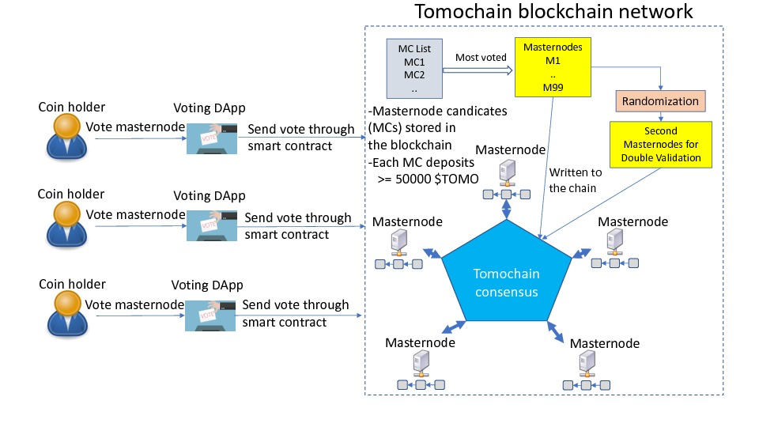
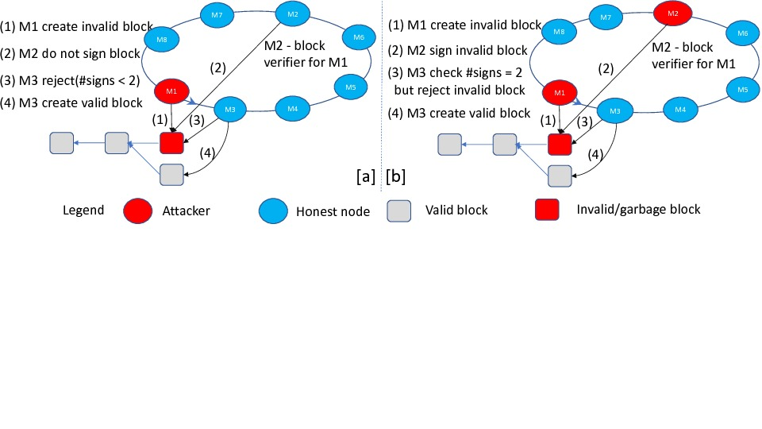
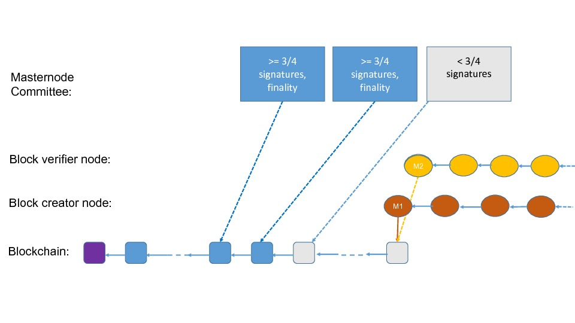
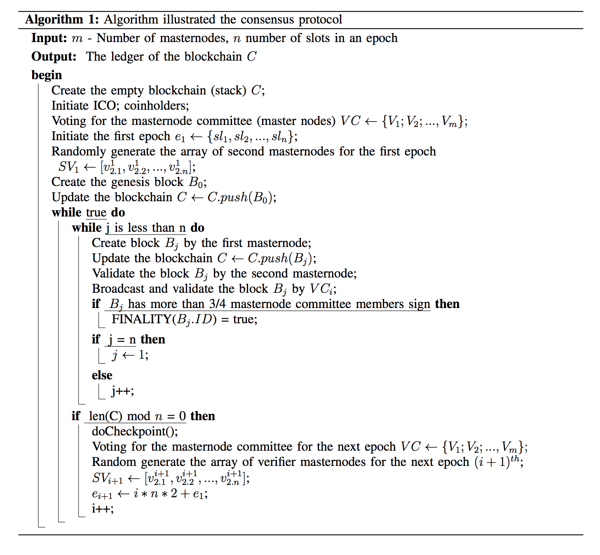

# Introduction

version 1.0 ([pdf version](https://tomochain.com/docs/technical-whitepaper--1.0.pdf))

The blockchain industry and the infrastructure of the Internet of Value
are being built rapidly around the globe, and to many the atmosphere is
eerily similar to the building of the Internet in the late ‘90s, with
pioneers and dreamers coming together to build a new future. **Tomochain** can be a
leading part of this phenomenon through seamlessly merging an ecosystem
of applications with cryptographic tokens used by millions of mainstream
users with a unique blockchain infrastructure architecture allowing for
a fast, secure, frictionless payment and trusted store of value.

Distributed systems have been researched in a “*permissioned setting*”
where the number of participants in the system and their identities are
common knowledge. In 2008, Satoshi Nakamoto - “proposed his celebrated
“blockchain protocol” which attempts to achieve consensus in a
permissionless setting: anyone can join (or leave) the protocol
execution (without getting permission from a centralized or distributed
authority), and the protocol instructions do not depend on the
identities of the players” @PassCrypto2017. Later on, Ethereum with its
Ethereum Virtual Machine (EVM) proposed several significant enhancements
compared to Bitcoin, including Smart Contracts. Both Bitcoin and
Ethereum have some issues, especially with transaction processing
performance. In order to construct an efficient and secured consensus
protocol for **Tomochain**, we tackle the following main bottlenecks of classic
blockchains:

-   **Efficiency:** Existing blockchains as employed by major
    crypto-currencies(e.g., Bitcoin or Ethereum) do not scale well to
    handle a large transaction volume, e.g. Bitcoin and Ethereum can
    handle around 10 transactions/second. This small throughput severely
    hinders a wide-spread adoption of such crypto-currencies.

-   **Confirmation times:** The 10 minutes Bitcoin block-time
     @Bitcoin08 is significantly larger than network latency.
    Furthermore, a Bitcoin block requires 5 subsequent blocks following
    it so that it can be confirmed; thus it takes on average one hour
    for a transaction to be confirmed (with low confidence). While
    Ethereum uses a smaller block-time, the average confirmation time
    still remains relatively high, around 13 minutes @Thunder2018
    [@Cardano2017]. These long confirmation times hinder many important
    applications (especially smart contract applications).

-   **Fork Generation:** The problem of fork chain consumes
    computational energy, time, and creates potential vulnerabilities
    for different types of attacks.

With the motivation as mentioned above, our persistent and ultimate goal
of research is to propose the consensus protocol focusing on the
following key strategies:

-   Double Validation to strengthen security and reduce fork

-   Randomization to guarantee the fair and prevent handshaking attack

-   Fast confirmation time and efficient checkpoints for finality or
    rebase

To start dealing with these problems, in this paper, we present an
overview architectural design of Tomochain’s master nodes. In particular, we
propose (PoSV) consensus, a Proof-of-Stake (PoS)-based blockchain
protocol with a fair voting mechanism, rigorous security guarantees and
fast finality. We also present a novel reward mechanism and show that,
with this mechanism, the blockchain has a low probability of forks, fast
confirmation times, plus the contributions and benefits of masternodes
are fair in the sense that the probability distribution function is
uniform eventually.

### Structure of the remainder of the paper

* [TomochainOverview](#Sec:MasternodeDesign): explains the intuition ideas and
overview architectural design of masternodes, framework and background
protocols that help mass readers (e.g., investors, traders, others) who
may not have technical knowledge understand our mechanism easily.
* [StakeVoting](#Sec:StakeVoting) presents **Tomochain** stakeholder policy, masternode
committee voting systems, and reward mechanism.
* [ProtocolOverview](#Sec:ProtocolOverview) explains the motivation and double
validation process as well as finality checkpoint of the protocol. 
* In Section [ProtocolFormalization](#Sec:ProtocolFormalization), we present the formalization of
our model in a mathematical way to show the soundness of our model and
protocol. 
* Section [SecurityAnalysis](#Sec:SecurityAnalysis) discusses the security
analysis and resistant strain of potential attacks. We discuss and
compare **Tomochain** with several existing blockchains in
Section 
* Section [related work](#Sec:relatedwork). 
* Finally, we conclude the paper in Section [Conclusion](#Sec:Conclusion).

## Tomochain Masternode Design {#Sec:MasternodeDesign}

### The Tomochain architecture {#Sec:TomochainOverview}

The **Tomochain** blockchain is produced and maintained by a set of *masternodes* in a
consistent manner through the **Tomochain consensus** protocol as shown in Fig.
[architecture](#fig:architecture). These masternodes are full nodes that hold \$TOMO.
For a coin-holder to become a masternode, two requirements must be
satisfied:

-   The coin-holder must hold at least a minimum required amount of coin
    (see next section for more details).

-   The coin-holder must be one of the most voted masternode candidates
    in the system. The voting by coin-holders is credited through a
    *Voting DApp* that allows coin-holders to *send \$TOMO through the
    smart contract mechanism*.

In addition to the voting system which is an improvement over the
current Bitcoin and Ethereum blockchain, also provides a new technique,
namely *Double Validation* complemented with a *Randomization*
mechanism. This new technique significantly decreases the probability of
having invalid blocks in the blockchain. These enhancements and the
components of **Tomochain** are step-by-step detailed in the followings.

{#fig:architecture}

## Stakeholders & Voting {#Sec:StakeVoting}

### Coin Holders, Masternodes {#coin-holders-masternodes .unnumbered}

Coin-holder is as simple as its name: users who join the network, who
own and transfer \$TOMO. Masternodes are full-nodes which maintain a
copy of the blockchain, produce blocks and keep the chain consistent. It
is worth noting that, **Tomochain** does not have miners as in the current
Proof-of-Work-based blockchain systems such as Bitcoin and Ethereum.
Only masternodes can produce and validate blocks.

Masternodes are selected via a voting system. The first requirement of
being masternodes is to deposit 50 000 \$TOMO to the Voting Smart
Contract. Then, these depositors are listed as masternode candidates in
the Voting DApp, which allows coin-holders to vote for them by sending
\$TOMO to the smart contract.

Masternodes which work hard in the system to create and verify blocks
will be incentivized with \$TOMO. Furthermore, coin holders who vote for
these incentivized masternodes will also receive \$TOMO in proportion to
the amount of \$TOMO they have invested via ballots. **Tomochain** engineers take
responsibility to design that fair, explicit, automated and accountable
reward mechanism.

The list of masternode candidates is dynamically sorted based on voted
coins. The performance of the masternodes will be tracked and reported
back to the coin holders in terms of three main metrics: CPU/Memory
charts which ensure the workload of the masternodes, the number of
signed blocks which indicates their work performance and the last signed
block which figures out their last activity. Coin-holders, at any time,
can unvote masternodes, who have low performance, and give their votes
to the other masternodes who have beter performance. Coin-holders have
incentives to do that because their voted coins are seen as investment
to their supported masternodes, thus they should choose a voting
strategy in order to maximize their profit from the investment.

This simple trick keeps the system healthy since masternodes always have
to race for their position so that all weak masternodes will eventually
be eliminated. Therefore, only the strongest masternodes are voted and
can flourish.

Voting & Masternode Committee {#voting-masternode-committee .unnumbered}

There are maximum ninety-nine masternodes elected in the masternode
committee. The required amount of deposit for masternode role is set at
50 000 \$TOMO. This amount is locked in a *voting smart contract*. Once
a masternode is demoted (by not remaining in the top ninety-nine voted
masternodes) or intentionally quits the masternode candidates
list/masternode committee, the deposit will have been locked for a
month.

Coin-holders can vote at any time, by any number of votes (which is
actually counted by the amount of \$TOMO they bet on some masternode
candidates). They can use masternode’s performance statistics in the
governance *Voting DApp* as reference information to give votes. The set
of masternodes is dynamically sorted by the amount of \$TOMO and counted
up to ninety-nine, upon reception of votes.

### Reward Mechanism {#reward-mechanism .unnumbered}

For each iteration of 990 blocks (called epoch), a checkpoint block is
created, which implements only reward works. The masternode, who takes
turn in the circular and sequential order to create block, has to scan
all of the created blocks in the epoch and count number of signatures.
The reward mechanism is designed following the policy as follow: the
higher number of signatures one masternode has made, the more reward he
earns. For instance, within an epoch, masternode A who has sealed twice
the blocks than masternode B earns double amount of \$TOMO than
masternode B does.

Furthermore, there is also a reward sharing ratio among coin-holders and
masternode who has been elected supported by the coin-holders. For
example, within an epoch, one masternode receives $X$ \$TOMO. Ten
percent of $X$ is sent to the masternode’s address. Eighty percent of
$X$ is shared in proportion to the amount of coins deposited and voted
by the masternode and coin-holders, respectively. The last ten percent
of $X$ credits to the **Tomochain** foundation. Coin-holders who unvote before the
checkpoint block will not receive any shared reward.

## Tomochain Consensus Protocol {#Sec:ProtocolOverview}

### Double Validation Process {#double-validation-process .unnumbered}

In TomoChain, masternodes share equal responsibility to run the system and keep
it stable. Full nodes should run on powerful hardware configuration and
high-speed network connectivity in order to ensure the required block
time (target to two seconds). Only masternodes can produce and seal
blocks. In order for that, the **Tomochain** consensus relies on the concept of
**Double Validation** that improves some existing consensus mechanisms,
namely **Single Validation**. In the followings, we first describe the
**Double Validation**, then analyze the differences and improvements of
**Double Validation** compared to **Single Validation**.

### Double Validation (DV)

Similar to some existing PoS-based blockchains such as Cardano, each
block is created by a block producer, namely masternode, that takes its
block creation permission turn following a pre-determined and circular
sequence of masternodes for each epoch. However, differently from these
existing blockchains, DV in **Tomochain** requires the signatures of two masternodes
on a block to be able to push the block to the blockchain. One of the
masternodes is the **block creator** while the other one, namely **block
verifier** is randomly selected among the set of voted masternodes that
validates the block and signs it. In the followings, for more
convenience, **block creator** and **block verifier** are used
interchangeably for the masternode 1 (block producer) and the randomly
selected masternode 2 for a block, respectively. The process of randomly
selecting the block verifiers is detailed in the next paragraphs. Note
that, there is no mining in the block creation as in Proof-of-Work-based
blockchains (e.g. Ethereum and Bitcoin). It means that a created block
is valid if and only if it is sealed by enough two signatures from a
block creator and a corresponding block verifier to confirm the
correctness of it.

We believe this DV technique enhances the stability of the blockchain by
diminishing the probability of producing “garbage” blocks while still
maintaining the system security and consistency. Randomization of block
verifiers in DV is the key factor of reducing risks coming from paired
masternodes trying to commit malicious blocks. Furthermore, comparing to
some current public blockchains in the market, by utilizing the DV
technique, **Tomochain** brings significant improvements in the block time by only
requiring two signatures per block. For the purpose of showing our
enhancement over existing PoS-based blockchains, we analyze the
differences between DV and the Single Validation mechanism in some
existing blockchains as follows.

### Improvements of Double Validation over Single Validation

Let’s show the improvements of DV compared to Single Validation through
analyzing some attacking scenarios as shown in Fig.
[SV](#fig:singlevalidation) and Fig. [DV](#fig:doublevalidation).

-   **Single Validation** In Single Validation, in an epoch, each
    masternode, e.g. M1, sequentially takes its turn to create a
    block, e.g. block100. The next masternode, e.g. M2, in the sequence
    then validates the created block100. If block100 is invalid (that
    potentially means that M1 is an attacker) and contains a transaction
    that invalidly benefits M1, if M2 is honest (see Fig.
    [SV a](#fig:singlevalidation)), it rejects block100 and creates
    another block100 next to block99. But, if M2 is an attacker
    (see Fig. [SV b](#fig:singlevalidation)) that corporates with M1,
    M2 ignores the invalidation of block100, signs it and creates next
    block, namely block101 that is valid. Then, the next masternode M3
    verifies that block101 is valid, M3 signs block101 and creates a
    block102. By this way, Single Validation potentially leaves the
    blockchain with “garbage” or invalid blocks which require a “rebase”
    to restore the validity of the blockchain.

{#fig:singlevalidation}

-   **Double Validation** We claim that our DV technique significantly
    reduces the probability of having garbage blocks in the blockchain.
    Assuming that M1 and M2 are the block creator and block verifier,
    respectively, for block100 in our DV. If block100 is invalid and M2
    is honest (see Fig. [DV a](#fig:doublevalidation)), M2 will not
    seal this block. Therefore, the next block creator M3 for creating
    block101 will see that block100 does not have enough 2 signatures,
    thus reject block100 and create another block100 next to block99. On
    the other hand, if M2 is also an attacker pairing/handshaking with
    M1 (see Fig. [DV b](#fig:doublevalidation)), M2 signs block100
    despite its invalidity (remember that the block verifier M2 is
    randomly selected, there has little chance of successfully pairing
    M1 and M2). Next, even though M3 will verify that block100 has two
    valid signatures, M3 still rejects it because block100 is
    invalidated by M3 that will create another valid block100. In order
    to break the stability and consistency of the blockchain in this
    case, M3 should be an attacker together with M1 and M2, which,
    however, has a very low probability. In other words, DV strengthens
    the consistency of the blockchain and makes it hard to break.

{#fig:doublevalidation}

Randomization for Block Verifiers for Double Validation {#randomization-for-block-verifiers-for-double-validation .unnumbered}
----

### The First Masternode/Block Creator {#the-first-masternodeblock-creator .unnumbered}

The first masternode/block creator in a given epoch $e$ can be selected
by a round-turn game and can be formal defined as an array:

$$\begin{bmatrix} 
\nu_1
\end{bmatrix}
= \begin{bmatrix} 
V_{1.1}^e  \\
V_{1.2}^e\\
\cdot\\
\cdot\\
\cdot\\
V_{1.n-1}^e\\
V_{1.n}^e\\
\end{bmatrix}$$

### Random Matrix and Smart Contract {#random-matrix-and-smart-contract .unnumbered}

Let $m$ be the number of masternodes, $n$ be the number of slots in an
epoch. In order to randomly generate the block verifiers for the next
epoch $e+1$, the process is performed by the following steps.

-   **Step 1: Random Numbers Generation and Commitment Phase:**

    First, at the beginning of epoch $e$, each masternode $V_i$ will
    securely create an array of $n+1$ special random numbers
    $ Recommend_i= [ r_{i.1}, r_{i.2}, ..., r_{i.n}, \theta_i]$, where
    $r_{i.k}\in [1, ..., m]$ indicating the recommendation of ordered
    list of block verifiers for the next epoch of $V_i$, and
    $\theta_i \in \{-1, 0, 1\}$ is used for increasing the
    unpredictability of the random numbers. Second, each masternode
    $V_i$ has to encrypt the array $Recommend_i$ using a secret key, say
    $Secret_i = Encrypt (Recommend_i)$. Next, each masternode forms a
    "*lock*” message that contains encrypted shares $Secret_i$; signs
    this message with its blockchain’s private key, specifies the
    epoch’s number and attaches its public key. In this case, every
    masternode can check who created this *lock* message and which epoch
    it relates to. Then, each node $V_i$ sends this *lock* message to a
    **Smart contract** stored in a block of the blockchain, so
    eventually each masternode collects and knows the *lock*s from all
    other masternodes.

-   **Step 2: Discovery and Recovery Phase:** The discovery phase is
    where a masternode sends an ”*unlock*” message, or special value for
    other masternodes to open its *lock*. A *lock* is like a black box
    (with a secret value $Secret_i$ encrypted of $Recommend_i$ in it),
    and the act of opening involves a key that reveals the box to
    retrieve the value of $Recommend_i$. Eventually, a masternode has
    both *lock*s and *unlock*s of others. If some elector is an
    adversary and can publish its *lock* but not publish its *unlock*,
    in this case, other masternodes can ignore the adversary’s *lock*
    and set all its random values be $1$ as default. The idea is simple:
    a masternode can keep working successfully even if some masternodes
    are adversaries.

-   **Step 3: Assembled Matrix and Computation Phase:** At the point of
    the slot $n^{th}$ of the epoch $e$, the secret arrays $Secret_I$ in
    the smart contract will be decrypted by each masternode and return
    the plain version of $Recommend_i$. Each tuple of the first $n$
    numbers of each $V_i$ will be assembled as the $i^{th}$ column of an
    $n \times m$ matrix. All the last number $\theta_i$ forms a
    $m\times 1$ matrix. Then each nodes will compute the block verifiers
    ordered list by some mathematical operations as explained below. The
    resulting output is a matrix $n \times 1$ indicating the order of
    block verifiers for the next epoch $e+1$.

### The Second Masternode/Block Verifier {#the-second-masternodeblock-verifier .unnumbered}

Then, each node soon compute the common array $\nu_2$ for the order of
the block verifiers by the following steps as in Equation \[eq:matrix\].

$$\label{eq:matrix}
\begin{bmatrix} \nu'_2
\end{bmatrix}
=
\begin{bmatrix}
v_{2.1}^{e+1} \\
v_{2.2}^{e+1} \\
\vdots \\
v_{2.n}^{e+1}
\end{bmatrix}
=
\begin{bmatrix}
r_{1.1}  & r_{2.1}            & \cdots  & r_{m.1}  \\
r_{1.2}     & r_{2.2}       & \ddots  & \vdots   \\
r_{1.3}      &  \ddots   & \ddots  & r_{m.3}  \\
\vdots  &              & r_{m-1.n-1}  & r_{m.n-1}  \\
r_{1.n}      & \cdots      & r_{m-1.n}      & r_{m.n}
\end{bmatrix}   
\begin{bmatrix}
\theta_1  \\
\theta_2  \\
\theta_3 \\
\vdots  \\
\theta_m
\end{bmatrix}$$

$$\label{eq:eq2}
\begin{bmatrix} \nu_2
\end{bmatrix}
=
\begin{bmatrix} \nu'_2 & mod & m
\end{bmatrix}
=
\begin{bmatrix}
\left| v_{2.1}^{e+1}\right| & mod & m \\
\left| v_{2.2}^{e+1} \right| & mod &  m\\
\vdots \\
\left| v_{2.n}^{e+1} \right| & mod & m
\end{bmatrix}$$

Then, $\nu_2$ is obtained by modulo operation of element values of
$\nu'_2$ as in Equation \[eq:eq2\]:

Finality Analysis {#finality-analysis .unnumbered}

There is a standard definition of “total economic finality”: it takes
place when $\frac{3}{4}$ of all masternodes make maximum-odds bets that
a given block or state will be finalized. This condition offers very
strong incentives for masternodes to never try colluding revert the
block: once masternodes make such maximum-odds bets, in any blockchain
where that block or state is not present, the masternodes lose their
entire deposit.

**Tomochain** keeps that standardization in the design so that one block is considered
as irreversible if it collects up to $\frac{3}{4}$ signatures of all
masternodes committee. The time-line of blockchain creation process,
checking finality and mark the block as immutable is described as in
Figure: [ChainMaking](#fig:ChainMaking) below.

{#fig:ChainMaking}

## Consensus Protocol: Formalization {#Sec:ProtocolFormalization}

### Basic Concepts & Protocol Description {#basic-concepts-protocol-description .unnumbered}

We begin by describing the blockchain protocol in the "stakeholder and
voting” setting, where leaders are assigned to blockchain slots with
probability proportional to their (fixed) initial stake and votes
received from coin-holders which will be the effective stake
distribution throughout the execution. To simplify our presentation, we
abstract this leader (chairman and vice-chairman) selection process,
treating it simply as an “ideal functionality” that faithfully carries
out the process of randomly assigning masternodes to slots. In the
following, we explain how to instantiate this functionality with a
specific secure computation.

To start, as we are dealing with proof of stake consensus algorithm, we
follow the way of formalization in the recent works in the literature
like  @Cardano2017 and  @Pass2017 [@PassCrypto2017]. In particular, we
recall the following concepts and definitions that were presented
in @Cardano2017:

### Time, Slots, Epoch {#time-slots-epoch .unnumbered}

We consider a setting where time is divided into discrete units called
*slots*. A ledger, described in more detail below, associates with each
time slot (at most) one ledger *block*. Players are equipped with
(roughly synchronized) clocks that indicate the current slot. This will
permit them to carry out a distributed protocol intending to
collectively assign a block to this current slot. In general, each slot
$sl_r$ is indexed by an integer $r \in \{1, 2, . . .\}$, and we assume
that the real time window that corresponds to each slot has the
following properties.

1.  The current slot is determined by a publicly-known and monotonically
    increasing function of current time.

2.  Each player has access to the current time. Any discrepancies
    between parties’ local time are insignificant in comparison with the
    length of time represented by a slot.

3.  The length of the time window that corresponds to a slot is
    sufficient to guarantee that any message transmitted by an honest
    party at the beginning of the time window will be received by any
    other honest party by the end of that time window (even accounting
    for small inconsistencies in parties’ local clocks). In particular,
    while network delays may occur, they never exceed the slot
    time window.

In each slot $sl_r$, and for each active masternode $V_j$ there will be
a set $S_j(r)$ of public-keys and stake pairs of the form
$(vk_i,s_i) \in {0,1}^* \times N$, for $i = 1,...,n_r$ where $n_r$ is
the number of users introduced up to that slot that will represent who
are the active participants in the view of $V_j$. Public-keys will be
marked as “idle” if the corresponding stakeholder has been corrupted.

As mentioned in Section TomochainOverview, in our setting, we assume that the fixed collection of $m$ masternodes
$V_1, V_2, ...., V_m$ interact throughout the protocol. Masternode $V_i$
possesses $s_i$ stake (coin) before the protocol starts. For each $V_i$
a verification and signing key pair $(vk_i,sk_i)$ for a prescribed
signature scheme is generated; we assume without loss of generality that
the verification keys $vk_1, . . .$ are known by all stakeholders.
Before describing the protocol, we establish basic definitions following
the notation of @Garay2015.

- **Genesis Block** The genesis block $B_0$ contains the list of
stakeholders identified by their public-keys, their respective stakes
$(vk_1, s_1), . . . , (vk_n, s_n)$ and auxiliary information $\rho$,
where the auxiliary information $\rho$ will be used to seed the slot
leader election process.

- **State** A state is an encoded string $st \in \{0,1\}^\lambda$.

- **Block** A block $B$ generated at a slot $ sl_i \in \{sl_1,...,sl_R\}$
contains the current state $st \in \{0, 1\}^{\lambda}$, data
$d \in \{0, 1\}^{*}$, the slot number $sl_i$ and a signature
$\Sigma  =  Sign_{ski} (st, d, sl_i)$ computed under $sk_i$
corresponding to the masternode $V_i$ generating the block.

- **Blockchain** A blockchain $C$ (or simply chain) relative to the
genesis block $B_0$ is a sequence of blocks $B_1,..., B_n$ associated
with a strictly increasing sequence of slots for which the state $st_i$
of $B_i$ is equal to $ H (B_{i-1})$, where $H$ is a prescribed
collision-resistant hash function. The length of a chain $len(C) = n$ is
its number of blocks. The block $B_n$ is the head of the chain, denoted
$head(C)$. We treat the empty string $\epsilon$ as a legal chain and by
convention set $head(\epsilon) = \epsilon$.

- **Epoch** An epoch is a set of $R$ adjacent slots
$S = \{sl_1, . . . , sl_R\}$. The value $R$ is also a parameter (slots
number in each epoch) of the protocol we analyze in our model.

As mentioned earlier, in our **Tomochain** model, we set each time *slot* $sl_i$ as 2
seconds; an epoch is a set $R$ of 990 slots
$\{ sl_1, sl_2, ..., sl_{990}\}$ (an epoch time duration equals to 1980
seconds).

In summary, the consensus protocol of **Tomochain** can be formalized in Algorithm ValidatorGeneration. The Algorithm ValidatorGeneration is simulated and explained as a
process shown in Fig. [EpochProcess](#fig:EpochProcess).

{#fig:EpochProcess}

## Security Analysis {#Sec:SecurityAnalysis}

### Nothing-at-stake {#nothing-at-stake .unnumbered}

Nothing-at-stake is a well-known problem in PoS-based blockchain, just
like 51% attack in PoW algorithm. PoW-based miners require CapEx
(capital expenditures) for buying mining equipment such as ASICs and
OpEx (operation expenditures) such as electricity to solve mathematical
puzzles securing the network @capex. That means, there is always an
intrinsic cost for miners in mining regardless of its success. In case
of a fork, miners therefore always allocate their resource (equipment)
to the chain that they believe is correct in order to get incentives for
compensating the intrinsic costs in mining.

In the contrary, in PoS-based systems without mining, during an ideal
execution, for creating a fork only costs, masternodes actually do not
incur intrinsic costs, other than roughly some block validation and
signing cost. As a result, there’s an inherent problem of the masternode
having no downside to staking both forks. Therefore, there are actually
two issues in the original design of PoS. On one hand, for any
masternode, the optimal strategy is to validate every chain/fork, so
that the masternode gets their rewards no matter which fork wins. On the
other hand, for attackers/malicious masternodes, they can easily create
a fork for double spending.

Let’s look back how **Tomochain** handles these two problems. As a reminder, **Tomochain** maintains
a certain order of masternodes in creating and sealing blocks, in each
epoch. For the first issue, random/arbitrary forks are hardly happened
because the order of block creation masternodes is pre-determined for
each epoch. Furthermore, the Double Validation mechanism eliminates the
second issue because even one malicious masternode creates two blocks at
his turn, only one block then can be validated by the second randomly
selected masternode.

## Long-range attack {#long-range-attack .unnumbered}

In **Tomochain**, block is valid only if it collects double validation and finalized
once $\frac{3}{4}$ of masternodes verify. Therefore, as long as the
number of attackers or malicious nodes and/or fail-stop nodes is less
equal than $\frac{1}{4}$ the number of masternodes, the number of
masternodes signing a block is at least $\frac{3}{4}$ the total number
of masternodes, which makes the block finalized. Thus, there is no
chance for one malicious masternode to create longer valid chain because
other masternodes will refuse it.

### Censorship Attack {#censorship-attack .unnumbered}

If there are more than $\frac{3}{4}$ malicious masternodes in **Tomochain**,
censorship attack might happen. For example, these masternodes refuse
valid blocks or simply become inactive. In this case, chain is stuck.

In fact, masternodes are paid for their effort of correctly working so
that the chain is actively updated in a consistent manner. More
importantly, becoming masternode means a certain amount of coins is
locked, 50 000 \$TOMO in particular. As a result, in order to control
more than$\frac{3}{4}$ masternodes, attackers must hold a considerable
amount of \$TOMO and gain huge support from coin-holders. And because of
this, the attackers do not have incentives to do any malicious action to
harm the chain.

However, in worst case, **Tomochain** has to do a soft fork in order to reduce number
of masternodes to keep the chain running and figure out slasher
mechanisms for those malicious masternodes.

### Relay Attack {#relay-attack .unnumbered}

**Tomochain** supports [EIP155](https://github.com/ethereum/EIPs/blob/master/EIPS/eip-155.md)
Transactions in **Tomochain** are included $CHAIN\_ID$ specified for different public
chains. Table \[table:chainid\] shows recognized $CHAIN\_ID$s.

  CHAIN\_ID  | Chain(s)
  -----------| ---------
  1          | Ethereum mainnet
  2          | Morden (disused), Expanse mainnet
  3          | Ropsten
  4          | Rinkeby
  30         | Rootstock mainnet
  31         | Rockstock testnet
  42         | Kovan
  61         | Ethereum Classic mainnet
  62         | Ethereum Classic testnet
  1337       | Geth private chains (default)
  77         | Sokol, the public POA Network testnet
  99         | Core, the public POA Network main network
  88         | Mainnet
  89         | Testnet

### Safety and liveness {#safety-and-liveness .unnumbered}

Safety implies having a single agreed upon chain where there are not two
or more competing chains with valid transactions in either @Safety. A
consensus protocol can be *safe* when blocks have settlement finality,
or else probabilistic finality. This last sentence reveals that can
provide safety because it has a settlement finality.

A consensus protocol is considered *live* if it can eventually propagate
and make valid transactions onto the blockchain @Safety. An occurrence
of a liveness fault is when transaction omission, information
withholding, or message reordering, among a number of violations are
observed. This type of fault is unlikely to happen in **Tomochain** because the block
creation masternodes list is ordered in a pre-determined way for each
epoch, thus if even an attacking masternode omits some transactions, the
latter will be processed and validated by the next honest masternode in
the next block.

### DDOS Attack {#ddos-attack .unnumbered}

Masternodes are encouraged to run in well-known public cloud providers
such as AWS, Google Cloud or Microsoft Azure which provides multiple
DDOS prevention mechanisms. Even in case that some nodes are attacked or
fail-stop, the network still works correctly as long as the number of
failing and/or attacked nodes is less than 1/4 of the number of
masternodes.

### Spam Attack {#spam-attack .unnumbered}

**Tomochain** keeps the same transaction fee mechanism as Ethereum which is indicated
via gasPrice. However, **Tomochain** supports minimum transaction fee (at 1 wei),
which somehow enables spamming that attacker tries to broadcast a huge
amount of low fee transactions to the system. However, **Tomochain** masternodes
always sort transactions and pick up only high fee transactions into the
proposing block. Thus, spammers have little chance to harm the system.

## Related work {#Sec:relatedwork}

Consensus plays an important role to guarantee the success of
distributed and decentralized systems. Bitcoin’s core consensus
protocol, often referred to as Nakamoto consensus @Bitcoin08, realizes a
“replicated state machine” abstraction, where nodes in a permissionless
network reach agreement about a set of transactions committed as well as
their ordering  @hybrid. However, known permissionless consensus
protocols such as Bitcoin’s Nakamoto consensus come at a cost. Bitcoin
and Ethereum rely on PoW to roughly enforce the idea of “one vote per
hashpower” and to defend against Sybil attacks. Unfortunately, PoW-based
Bitcoin and Ethereum are known to have terrible performance (Bitcoin’s
transaction processing performance is at peak of around 7 transactions
per second as previously mentioned). Moreover, PoW is much criticized
because it costs a lot of electricity energy.

In order to design an efficient and cost-effective consensus protocol in
the permissionless model, PoS has been discussed extensively in the
Bitcoin and Ethereum forum @Ethe2014 [@Larime2016]. A PoS blockchain can
substitute the costly PoW in Nakamoto’s blockchain while still providing
similar guarantees in terms of transaction processing in the presence of
a dishonest minority of users, where this “minority” is to be understood
here in the context of stake rather than computational
power @Cardano2017. The Ethereum design Casper @Casper, published by
Buterin & Griffith, provides as its initial version a PoW/PoS hybrid
consensus protocol, which might eventually switch to a pure PoS system.
As in **Tomochain**, Ethereum Casper requires that *validators* (term similar to
block creators) have to deposit an amount. In fact, some concepts used
in **Tomochain** such as checkpoint blocks are borrowed from Casper. Our (PoSV)
consensus protocol proposed in this paper can be seen as a hybrid model.
In particular, first, we apply with voting and **Double Validation** to
create, verify and vote for blocks smoothly and efficiently. Whenever
potentials of fork branches are detected, we employ the idea in PoW to
select the longest branch with the most votes and discard the other
branches. With this hybrid approach, does not only increase the
performance and security of blockchain, but also reduce the fork
situation in an efficient and practical manner.

Recently, there are several consensus protocol research works that are
closely related to **Tomochain** such as EOS @EOS and Ouroboros of
Cardano @Cardano2017. The mechanism of *voting* for masternodes for
reaching consensus is utilized by Bitshares @bitshare and EOS @EOS,
whose consensus protocol is termed *Delegated Proof-of-Stake* (DPoS).
DPoS is similar to the Proof-of-Stake Voting consensus of **Tomochain** in the sense
that masternodes (block creators or *witnesses* in DPoS) are elected
through a voting system. However, **Tomochain** requires that masternodes need to
deposit a required minimum amount of \$TOMO to become a masternode
candidate, which puts more pressure on the masternodes to work honestly.
Furthermore, the **Double Validation** mechanism of **Tomochain** lowers the
probability of handshaking attacks and having invalid blocks, as
previously analyzed. EOS also has a maximum of 21 block producers for
each epoch, which is *less decentralized* than **Tomochain** with a maximum of 99
masternodes elected.

The research-backed Cardano @Cardano2017 blockchain solution, namely
Ouroboros, with the ADA coin, which is purely based on Proof-of-Stake,
promisingly claims to provide rigorous security guarantees. Similarly to
**Tomochain**, Ouroboros has a set of block producers for each epoch for creating
blocks and each block producer candidate needs to deposit a minimum
amount of stake (an amount of ADA). However, note that, Ouroboros only
provides **Single Validation**, while **Double Validation** of **Tomochain** provides
several advantages over Single Validation, as previously analyzed. In
Ouroboros, the order of block producers, selected among stakers, is
based on a biased randomization while the Tomochain’s randomization for block
verifiers is potentially uniform and based on smart contracts.
Furthermore, the use of voting as in Tomochain and DPoS enables a more incentive
equality between stakers: In Ouroboros, stakers with very little stake
have a very small probability of becoming block creators, while, in Tomochain,
these stakers can choose an optimal strategy to vote for potential
masternodes to get incentives.

## Conclusion and perspectives {#Sec:Conclusion}

In this paper, we proposed PoSV, a PoS Voting-based blockchain protocol
with heuristic and fair voting mechanism, rigorous security guarantees,
and fast finality. We also presented a novel reward mechanism and show
that, with this mechanism, the blockchain has a low probability of
having forks, fast confirmation time, plus the contributions and
benefits of masternodes are fair in the sense that the probability
distribution function is uniform eventually.

## Perspectives {#perspectives .unnumbered}

-   **Future work** The **Tomochain** team is currently working on the implementation
    of the Proof-of-Stake Voting, which will be released on schedule as
    stated in our roadmap. Furthermore, in parallel with our novel
    consensus protocol, we will investigate the Sharding mechanism in
    order to provide even better transaction processing performance. We
    believe that, the Sharding technique with the stable number of
    masternodes will provide better stability and efficiency to
    the blockchain. At the same time, we commit to keep EVM-compatible
    smart contracts within our masternode sharding framework.

-   **Economic sustainability** is also an important concept for a
    blockchain based decentralized network. That means to maintain the
    network in a sustainable condition, an equilibrium needs to be
    achieved, in which the cost of running the network infrastructure
    could be offset by the revenues generated. In this context, the cost
    of network infrastructure consists of two parts: the physical cost
    of having hardware such as servers, memories that passes the network
    technical requirements; and the capital cost of having \$TOMO locked
    into smart-contracts. The revenues for Masternodes would primarily
    come from Reward Engine emission, and later on from service revenues
    such as token exchange fees provided by applications running on top
    of TomoChain. We will publish a TomoChain economic analysis and
    proposal, separate from this technical paper in a later date.

## :fa-book: References {#Sec:References}

Satoshi Nakamoto. Bitcoin: A peer-to-peer electronics cash system. 2008. [pdf](https://bitcoin.org/bitcoin.pdf)

Ethereum Foundation. Ethereum’s White Paper. , 2014. Online available 25/05/2018. [link](https://github.com/ethereum/wiki/wiki/White-Paper)

D. Larimer. Delegated Proof-of-Stake (DPOS). BitShare White Paper 2014.

S. King and S. Nadal. PPCoin: Peer-to-peer crypto-currency with
proof-of-stake. Self-Published, 2012. [pdf](https://peercoin.net/assets/paper/peercoin-paper.pdf)

V. Buterin. On public and private blockchains. Ethereum Blog, 2015.

A. Kiayias, A. Russell, B. David, and R. Oliynykov: Ouroboros: A
Provably Secure Proof-of-Stake Blockchain Protocol. IACR-CRYPTO-2017. [pdf](https://eprint.iacr.org/2016/889.pdf)

D. Mingxiao, et al. A Review on Consensus Algorithms of Blockchain. 2017
IEEE International Conference on Systems, Man, and Cybernetics (SMC)
Banff Center, Banff, Canada, October 5-8, 2017

R. Pass and E. Shi. Rethinking Large-Scale Consensus. In the Proceedings
of the IEEE 30th Computer Security Foundations Symposium, 2017. Thunder
Token Foundation: Thunder Consensus White Paper, Janurary, 2018.

R. Pass, L. Seeman, and A. Shelat. Analysis of the Blockchain Protocol
in Asynchronous Networks. In EUROCRYPTO 2017.

Juan A. Garay, A. Kiayias, and N. Leonardos. The bitcoin backbone
protocol: Analysis and applications. In Elisabeth Oswald and Marc
Fischlin, editors, Advances in Cryptology - EUROCRYPT 2015, Volume 9057
of Lecture Notes in Computer Science, pages 281–310. Springer, 2015.

Tendermint Team. Understanding the Basics of a Proof-of-Stake Security
Model.
https://blog.cosmos.network/understanding-the-basics-of-a-proof-of-stake-security-model-de3b3e160710.
Online available 25/05/2018.

EOS Team. EOS.IO Technical White Paper v2.
<https://github.com/EOSIO/Documentation/blob/master/TechnicalWhitePaper.md>.
Online available 25/05/2018. [link](https://github.com/EOSIO/Documentation/blob/master/TechnicalWhitePaper.md)

Bitshares Team. Delegated Proof-of-Stake Consensus.
https://bitshares.org/technology/delegated-proof-of-stake-consensus/.
Online available 25/05/2018. [link](https://bitshares.org/technology/delegated-proof-of-stake-consensus)

R. Pass, and E. Shi. (2017). Hybrid consensus: Efficient consensus in
the permissionless model. In LIPIcs-Leibniz International Proceedings in
Informatics (Vol. 91). Schloss Dagstuhl-Leibniz-Zentrum fuer Informatik.

V. Buterin, and V. Griffith. (2017). Casper the Friendly Finality
Gadget. arXiv preprint arXiv:1710.09437. [link](https://arxiv.org/abs/1710.09437)

H. McCook. Under the Microscope: Economic and Environmental Costs of
Bitcoin Mining.
<https://www.coindesk.com/microscope-economic-environmental-costs-bitcoin-mining/>.
Online available 25/05/2018.
